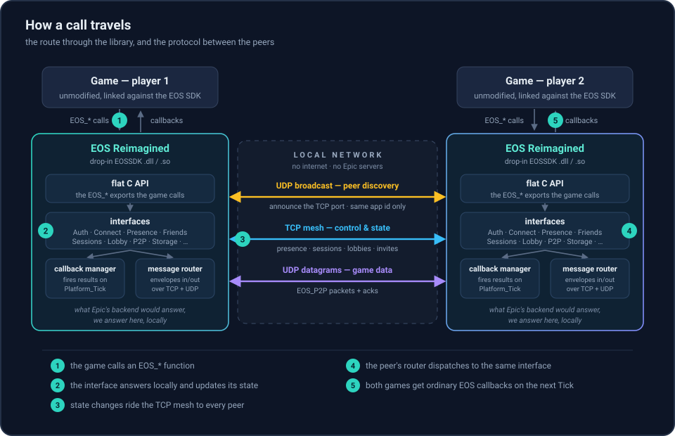

<div align="center">

# EOS Reimagined

### *The FOSS alternative to EOS.*


<br>
<br>

[](LICENSE)


[](#contributing)

[**Explore the wiki »**](https://anishgoyal1108.github.io/EOS-Reimagined/)

[Report a bug](https://github.com/anishgoyal1108/EOS-Reimagined/issues/new) · [Request a feature](https://github.com/anishgoyal1108/EOS-Reimagined/issues/new)

</div>

<details>
  <summary>Table of contents</summary>
  <ol>
    <li><a href="#background">Background</a></li>
    <li><a href="#how-it-works">How it works</a></li>
    <li><a href="#running-it">Running it</a></li>
    <li><a href="#a-statement-on-feature-parity">A statement on feature parity</a></li>
    <li><a href="#a-statement-on-piracy-and-cheating">A statement on piracy and cheating</a></li>
    <li><a href="#contributing">Contributing</a></li>
    <li><a href="#license">License</a></li>
    <li><a href="#acknowledgments">Acknowledgments</a></li>
  </ol>
</details>

## Background

[Epic Online Services](https://onlineservices.epicgames.com/sdk) is currently one of the most popular solutions for facilitating peer-to-peer connectivity in video games. It's free and cross-platform, and all you have to do as a developer is ship your game against the EOS SDK. Epic's backend handles the rest: accounts, matchmaking, lobbies, sessions, and the peer-to-peer connections between players. The catch is that every one of those features lives on Epic's servers. When those servers go away because the service is sunset, the game is delisted, or the publisher moves on, the multiplayer goes with them, even for players who legitimately own the game and still have working copies. For this reason, the [Stop Killing Games](https://www.stopkillinggames.com/) movement has gained significant traction within the open source community for modifying disserviced games' netcode for online play again.  

As firm believers in the Stop Killing Games movement, we believe there needs to be an alternative for those who don't want to rely on Epic for connectivity: no account; no login; no cloud; just the game facilitating a connection between clients. That's where EOS Reimagined comes in. A game that uses the EOS SDK links against its shared library — `EOSSDK-Win64-Shipping.dll` on Windows, `libEOSSDK-Linux-Shipping.so` on a native Linux title — which provides the API through Epic's backend. EOS Reimagined is a standalone drop-in for that shared library. It implements the calls a game makes to reach multiplayer and wires players together directly over the local network instead of through Epic. It is a work in progress: the multiplayer and social core is in place, and the remaining interfaces are being filled in one at a time (see [the roadmap](https://anishgoyal1108.github.io/EOS-Reimagined/users/roadmap.html) for exactly what is present today). For a game that only needs the parts already built, everything works normally.

<p align="center">
  
</p>

## How it works

Under the hood, EOS Reimagined exports the same flat C API as the real SDK, so a game that stays within the surface we have implemented cannot tell the difference: it loads the library, calls `EOS_Initialize` and `EOS_Platform_Create`, grabs interface handles, and ticks the platform once a frame, exactly as it would against Epic's DLL. (Interfaces we have not really built yet are still exported, as honest shells that answer `EOS_NotImplemented` — so the game loads either way, and a feature is absent rather than fatal until it's built. See below.) Behind those exports, the interfaces that carry multiplayer are implemented locally, and the compatibility surface that is present answers safely enough that a game will launch (see [the roadmap](https://anishgoyal1108.github.io/EOS-Reimagined/users/roadmap.html) for exactly which interfaces are implemented, which are honest stubs, and which are not exported yet). Ownership checks are answered on the spot, and async calls follow the SDK's own contract: a request is queued, resolved either immediately or when a peer replies, and the game's callback fires on a later `EOS_Platform_Tick` — the same lifecycle the game already expects.

The entire library is written to the **C++11 standard and nothing newer**, and this is deliberate, not incidental. EOS titles and the toolchains they shipped with are frequently old, and a drop-in replacement has to build, link, and run cleanly beside them; holding the line at C++11 (enforced in the build, with no compiler extensions) keeps the library portable across the ancient and the modern alike. It is also fully OS-agnostic: one source tree produces both the Linux `.so` and the Windows `.dll`, with every OS-specific dependency quarantined behind a small platform shim and zero reliance on Epic's own pile of Windows-only system libraries.

Your identity is a key, not an account. On first run the library generates an X25519 profile and keeps it in a small file; your player ids are *derived* from its public half, and its private half is what proves them to other players. Nobody can answer to your identity without holding your key, and copying that one file to another machine makes you the same player there. Several copies of a game on one machine each take their own profile, so couch co-op is several players rather than one confused one.

Multiplayer is a mesh over your local network. Every running copy periodically broadcasts a small UDP advertisement saying where it listens — but that broadcast is only a hint, and nothing in it is believed. A peer that answers runs a Noise XX handshake first, and only once it has proved which key it holds does it become a peer at all; the id it is adopted under is recomputed from that key, never read off the wire. Every message afterwards is sealed under it, so a forged, tampered, or replayed frame simply does not open. A different game cannot complete the handshake at all, so two unrelated games on one LAN do not merely ignore each other — they cannot talk. Control traffic (presence, sessions, lobbies) travels over that authenticated TCP mesh; `EOS_P2P` packets the game marked unreliable go as sealed UDP datagrams instead, because a packet the game is willing to lose should not be holding up the ones behind it. There is no central anything: a lobby or session lives on the peer that created it, and a search is just a question sent to the peers you know. The wire format and per-interface behavior are documented in [the protocol notes](https://anishgoyal1108.github.io/EOS-Reimagined/developers/internals/protocol.html), [ADR 0001](https://anishgoyal1108.github.io/EOS-Reimagined/developers/internals/adr/0001-authenticated-mesh-identity.html), and the rest of [the wiki's internals section](https://anishgoyal1108.github.io/EOS-Reimagined/developers/internals/).

## Running it

EOS Reimagined finds other players by broadcasting on the local network, so the working assumption is that **everyone who wants to play together is on the same LAN — the same Wi‑Fi network or wired subnet.** There is no matchmaking server and no Internet traversal yet: if two machines can't reach each other with a UDP broadcast, they won't discover each other. Two copies on a single machine work too, and are the simplest way to try it.

The library is a drop-in, so running it is a matter of putting it where the game already looks for Epic's SDK:

1. **Get the right artifact for the game, not the machine.** A native Linux game loads `libEOSSDK-Linux-Shipping.so`; build the Linux `.so` and use that. A Windows game loads `EOSSDK-Win64-Shipping.dll` — and it keeps loading the *Windows* DLL even when it runs under Proton or Wine, so those players want the cross-compiled `.dll`, not the `.so`. Both come from this one source tree: configure with CMake and build the `eos_shared` target (see below).
2. **Back up the original.** Rename the game's existing `EOSSDK-Win64-Shipping.dll` / `libEOSSDK-Linux-Shipping.so` (e.g. add a `.orig` suffix) so you can put Epic's back when you're done.
3. **Drop ours in under the same filename**, in the same folder the game shipped Epic's in.
4. **Give each player their own identity.** On first run the library mints a key-derived profile and saves it; that key *is* the player. Several copies on one machine each take their own profile slot automatically, so couch co-op is several distinct players rather than one confused one. To keep a copy's profile and data somewhere specific (useful for running multiple isolated instances), point it at a directory with the `EOSR_DATA_DIR` environment variable.
5. **Launch the game normally and use its own menus.** Host a game or open its server/lobby browser exactly as you would online; peers running EOS Reimagined on the same LAN discover each other, complete an authenticated handshake, and show up to be joined.

A few practical notes: every player must be running the *same game* with EOS Reimagined dropped in — a different game (or Epic's real SDK against Epic's servers) will not mesh with you. Make sure the host firewall allows the discovery, control, and P2P traffic on the LAN. And this is LAN-only today; playing across the open Internet is deferred, not done.

Building both artifacts from the source tree:

```sh
# Linux .so (native Linux games)
cmake -S . -B build -DCMAKE_BUILD_TYPE=Release
cmake --build build --target eos_shared      # -> build/libEOSSDK-Linux-Shipping.so

# Windows .dll (Windows games, including under Proton/Wine) via MinGW-w64
cmake -S . -B build-win -DCMAKE_BUILD_TYPE=Release \
      -DCMAKE_TOOLCHAIN_FILE=cmake/toolchain-mingw-w64.cmake
cmake --build build-win --target eos_shared   # -> build-win/EOSSDK-Win64-Shipping.dll
```

## A statement on feature parity
EOS Reimagined is a reverse-engineered stand-in, not a certified replacement, and we cannot guarantee it behaves one-to-one with Epic's real SDK. True parity would mean rebuilding Epic's entire backend---matchmaking servers, voice relays, anti-cheat---and that is an enormous amount of work we have not done and may never fully do. So far, the emulator does the part that keeps games playable: it answers the SDK's calls locally and connects players directly to each other over the network. Identity (Connect and Auth), sessions, lobbies, presence, peer-to-peer messaging, and the social interfaces (Friends and UserInfo) are wired up over the authenticated mesh, so the multiplayer core works. A small compatibility surface — the overlay/UI interface and the integrated-platform interface — is present as an honest shell: it exports what a game resolves at load and answers safely, because a single missing export would stop the game in the loader before the SDK ever runs. The remaining interfaces — RTC voice, anti-cheat, achievements, stats, leaderboards, storage, commerce, metrics, and the rest — are exported as **honest not-implemented shells**: the game loads and runs, those calls answer `EOS_NotImplemented`, and a game that cannot reach its multiplayer without one of them will not get there until it is really built. You can see exactly what is implemented, stubbed, or still absent for each interface on [the wiki](https://anishgoyal1108.github.io/EOS-Reimagined/) (start with [the roadmap](https://anishgoyal1108.github.io/EOS-Reimagined/users/roadmap.html)). There's still a lot of work to be done to ensure the utmost compatibility, but here are two limitations worth calling out up front:

1) **It authenticates keys, not accounts, and does no anti-cheat.** The transport between copies is not plaintext: peers run a Noise XX handshake, every frame afterward is sealed, and the identity a peer is adopted under is *derived* from the key it proved rather than anything it claims on the wire — so a forged, tampered, or replayed message simply does not open. What that authentication cannot do is attest a real Epic account or that you own the game; that would require Epic, and we do not pretend to it. And we implement none of Epic's anti-cheat — a game that leans entirely on Epic Anti-Cheat for integrity gets no protection from this library, so a modified client is, in theory, harder to keep out than it would be on Epic's backend unless the game enforces its own checks.

2) **It does not talk to Epic.** The emulator speaks its own reconstructed peer-to-peer protocol between copies of *itself*, discovered over the local network; it never connects to Epic's servers. Because of that, we cannot guarantee — and generally do not expect — that someone running EOS Reimagined can matchmake or play with someone running the genuine EOS SDK against Epic's live backend. This is a tool for connecting emulator to emulator, not emulator to Epic. It follows, then, that we do **not** intend to support letting pirated copies slip onto official servers or play alongside legitimate owners (more on this below).  

## A statement on piracy and cheating

**This tool is for keeping games playable. We will *never* support players who wish to use EOS Reimagined to play on cracked copies of games or develop cheats.**

This project shall *only* be used to facilitate splitscreen, couch co-op, or running multiple sessions for games that do not natively support those features and are dying. Think LAN parties for a game whose servers went dark, or getting two local copies to see each other for co-op that the developer never shipped. Therefore, it is expected that you have your own legitimately-owned copies of the game. There are already some great communities for accomplishing this, and we encourage you to look into those as well (*i.e.,* [SplitScreen.me](https://splitscreen.me), [Nucleus Co-op](https://nucleus-coop.github.io), and [PartyDeck](https://github.com/partydeck/partydeck) ). 


## Contributing

This project is, and always will be, free for everyone. This is still a work in progress, but the eventual hope is to get split screen and local co-op working on all EOS games, regardless of the operating system.

Pull requests, issues, and contributions are more than encouraged! Whether it's adding support for another game, fixing a busted call, improving the documentation, or porting to another platform, we'd love to have your help. The full documentation — setup guides, the configuration reference, and the technical spec of how the EOS SDK behaves — lives on [the wiki](https://anishgoyal1108.github.io/EOS-Reimagined/).

## License

EOS Reimagined is free software, released under the GNU General Public License v3.0. See [`LICENSE`](LICENSE) for the full text.

## Acknowledgments

This project would not exist without Nemirtingas, whose original work on the EOS emulator years ago helped make this project a reality. We would also like to thank the following communities for their pivotal work in making co-op gaming a reality and reducing planned obsolescence in gaming as a whole: Stop Killing Games, SplitScreen.me, Nucleus Co-op, and PartyDeck.
