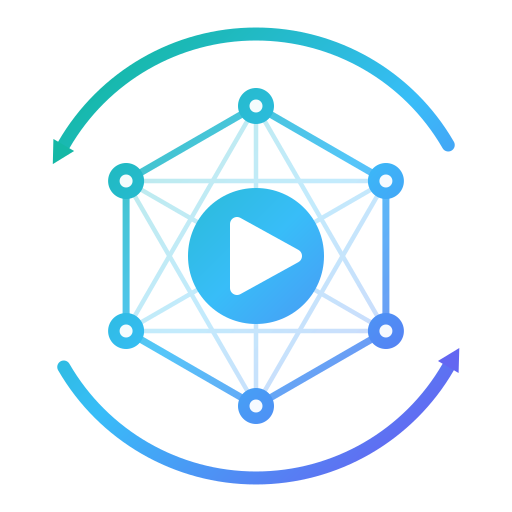

::: {.hero}
::: {.hero-logo}
{fig-alt="EOS Reimagined logo"}
:::

# [EOS Reimagined]{.gradient-text}

::: {.hero-tagline}
The FOSS alternative to Epic Online Services.
:::

::: {.hero-lede}
A game built on the EOS SDK stops playing multiplayer the day Epic's servers stop answering for it.
EOS Reimagined is a **drop-in replacement for the EOS SDK's shared library** that answers those same
calls locally and wires players together directly over the local network — no account, no login,
no cloud. Just the game, facilitating a connection between clients.
:::

::: {.hero-buttons}
[Get started](guide/getting-started.qmd){.btn .btn-primary}
[What works today](project/roadmap.qmd){.btn .btn-outline-secondary}
[GitHub](https://github.com/anishgoyal1108/EOS-Reimagined){.btn .btn-outline-secondary}
:::
:::

::: {.diagram-panel}
{fig-alt="Two unmodified copies of a game, each loading EOS Reimagined, connected directly over the local network by UDP peer discovery, a TCP control mesh, and UDP game data"}
:::

## How it works

::: {.grid}
::: {.g-col-12 .g-col-md-4}
::: {.feature-card}
[🎭]{.card-icon}

### Same ABI, no backend

The library exports the same flat C API as `EOSSDK-Win64-Shipping.dll` /
`libEOSSDK-Linux-Shipping.so`. Within the implemented surface, the game cannot tell the
difference — it initializes, grabs interfaces, and ticks exactly as it would against Epic's DLL.
:::
:::

::: {.g-col-12 .g-col-md-4}
::: {.feature-card}
[🔑]{.card-icon}

### Your identity is a key

On first run the library mints an X25519 profile; your player IDs are derived from its public
half. Every connection runs a Noise&nbsp;XX handshake and every frame after it is sealed — nobody
can wear your identity without holding your key.
:::
:::

::: {.g-col-12 .g-col-md-4}
::: {.feature-card}
[🕸️]{.card-icon}

### Multiplayer is a LAN mesh

Copies of the game discover each other with UDP broadcasts, then build an authenticated TCP mesh
for control traffic. Gameplay packets the game marks unreliable travel as sealed UDP datagrams.
There is no central anything.
:::
:::
:::

## Explore the wiki

::: {.grid}
::: {.g-col-12 .g-col-md-4}
[
::: {.feature-card}
[🚀]{.card-icon}

### Getting started

Drop the library into a game, give each player an identity, and host from the game's own menus.
:::
](guide/getting-started.qmd){.card-link}
:::

::: {.g-col-12 .g-col-md-4}
[
::: {.feature-card}
[⚙️]{.card-icon}

### Configuration

Every `eosr.json` key and `EOSR_*` environment variable: defaults, validation, and precedence.
:::
](guide/configuration.qmd){.card-link}
:::

::: {.g-col-12 .g-col-md-4}
[
::: {.feature-card}
[📡]{.card-icon}

### Networking & firewalls

The discovery ports, the authenticated mesh, and what to allow through a firewall.
:::
](guide/networking.qmd){.card-link}
:::

::: {.g-col-12 .g-col-md-4}
[
::: {.feature-card}
[🗺️]{.card-icon}

### Roadmap & status

Exactly which EOS interfaces are live, which are honest shells, and which don't exist yet.
:::
](project/roadmap.qmd){.card-link}
:::

::: {.g-col-12 .g-col-md-4}
[
::: {.feature-card}
[🔬]{.card-icon}

### Internals

The behavioral spec: core runtime, wire protocol, mesh identity ADR, and per-interface notes.
:::
](internals/index.qmd){.card-link}
:::

::: {.g-col-12 .g-col-md-4}
[
::: {.feature-card}
[🤝]{.card-icon}

### Contributing

C++11, cross-platform by construction, and adversarially reviewed. Here's how to help.
:::
](project/contributing.qmd){.card-link}
:::
:::

## Why this exists

[Epic Online Services](https://onlineservices.epicgames.com/sdk) is one of the most popular ways
to ship multiplayer: it's free, it's cross-platform, and Epic's backend handles accounts,
matchmaking, lobbies, sessions, and peer connections. The catch is that every one of those
features lives on Epic's servers. When those servers go away — the service is sunset, the game is
delisted, the publisher moves on — the multiplayer goes with them, even for players who
legitimately own working copies.

As firm believers in the [Stop Killing Games](https://www.stopkillinggames.com/) movement, we
think there needs to be an alternative for people who don't want their games' multiplayer to
depend on anyone's backend. EOS Reimagined keeps dying games playable: LAN parties for a game
whose servers went dark, couch co-op the developer never shipped, several local copies meshing on
one machine.

It is equally not a piracy or cheating tool: it connects **emulator to emulator**, never to
Epic's live services, and it implements none of Epic's anti-cheat. Read the full
[scope & non-goals](project/scope.qmd).

::: {.callout-note appearance="simple"}
EOS Reimagined is an independent free-software project. It is not affiliated with, endorsed by,
or supported by Epic Games. "Epic", "Epic Games", and "Epic Online Services" are trademarks of
Epic Games, Inc.
:::
